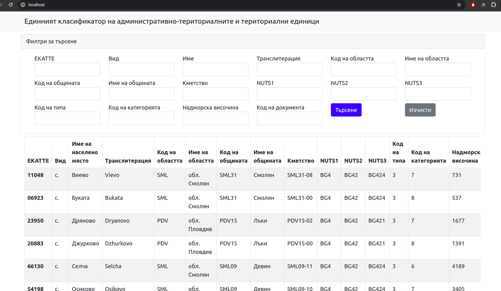

# 🗂 Tech Stack

Below is a list of technologies we use at this project

*  🎨 **Frontend:**  Bootstrap 5
* 🏗 **Backend:** PHP 8.3
* 📚 **Database:** MySQL
* 💻 **Server:** Docker, phpMyAdmin

## 📊 Install using Docker, phpMyAdmin and MySQL
### 1. Set environment variables
First you need to create ```.env``` file in the main directory with the data from ```.env.example``` file.

### 2. Creating all Dockers
```
make build
```

### 3. Start all dockers
```
make run
```

#### 3.1. Run only first time when create all docker images this command to setup all database
```
make setup
```
### 4. Stop all dockers
```
make stop
```

## Site Address 
> http://localhost:8000/

## phpMyAdmin Address
> http://localhost:8080/


## Screenshots

### Interface



